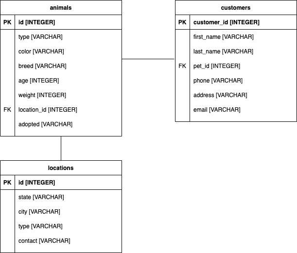

#  Quiz 4  

## Task
Your task for Quiz 4 is to write SQL queries to answer the following questions.

You will not have access to the actual database to answer these questions. You are given the ERD and are asked to submit queries that would answer the questions.

The database is maintained by a local animal shelter with a few different shelter locations in various cities and states near you. They keep track of all of the animals that are in their care and the people that adopt their animals.

An ERD for this database is given below. Primary keys of the tables are labeled with `PK` and foreign keys are labeled with `FK`.    

Write queries to answer the following questions. Write your queries for each question in an ipy notebook, markdown file, or doc file, but in the latter case be sure to export it as a PDF before submitting.

## Questions
1. Get the first 10 rows and all columns of the animals table (get all columns but limit the result of the query to 10 items).
2. Get a list of the unique breeds of animals.
3. Get all of the ages and weights of black dogs (`type` is `dog` and `color` is `black`).
4. Get all of the types and breeds of animals that weigh more than 55 pounds.
5. Get a list of all customers using gmail (customers whose emails end in `@gmail.com`).
6. Get the average weight by breed of breeds that average at least 40 pounds.
7. Get the last name of all people who have adopted a cat (`type` is `cat`).
8. Grouping by type, get the average age of each type of animal. Name the average age column `avg_age`.
9. How many rabbits (`type` is `rabbit`) are located in New York (`state` is `New York`)?
10. Get the pet ID, breed, customer ID, and city of dogs (`type` is `dog`) who have been adopted (`adopted` is `Yes` or `yes`). Order the results alphabetically by breed.

## Quiz Information
- This is an "open book" quiz - you may use any resources! This includes Jupyter notebooks, Google, StackOverflow, and your notes. ANY RESOURCE YOU USE MUST BE CITED (comment your code with links, which lesson you got the inspiration from, etc.) and failure to cite resources you use will be considered plagiarism.
- You may NOT work with anyone else on this quiz (your classmates, your instructor, etc.).
- You will have 1 hour to take this quiz.
- Do your best and good luck!

## Learning Targets Assessed
You should be able to:
- Implement SQL commands
- Apply groupbys, joins, and aggregations to SQL tables

## Motivation
In many data science interviews, you will be required to complete a technical test or take-home assignment. These are often in the form of a coding challenge or a task given for you to complete within a certain amount of time. These quizzes are designed to mimic that process to prepare you to be successful during the interview process.
